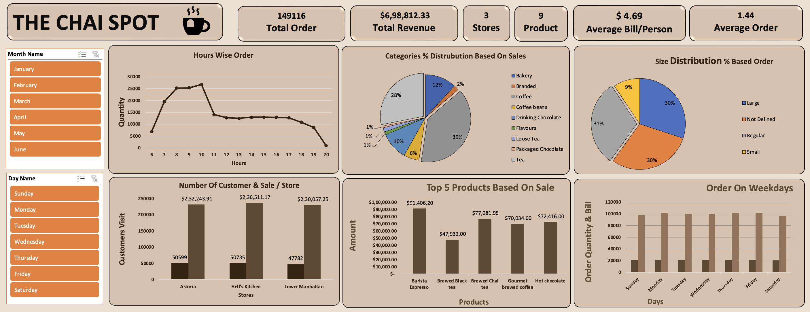

# ☕️ Coffee Shop Sales Analysis

## 📊 Project Overview
This project analyzes coffee shop sales data using Microsoft Excel to identify sales trends, customer buying patterns, and product performance.

The dashboard provides insights into revenue, transactions, and store performance.

---

## 🔧 Tools Used

• Microsoft Excel  
• Pivot Tables  
• Charts  
• Data Cleaning  

---

## 📈 Key Features

1. Tracked KPI metrics like Total Revenue and Transactions
2. Monthly, Daily, and Hourly Sales Analysis
3. Top Performing Products by Category
4. Store Location Wise Sales Analysis
5. Customer Buying Pattern Analysis

---

## 📊 Dashboard Preview

---

## 🚀 Insights from the Analysis

• Peak sales occur during morning hours  
• Coffee beverages dominate product sales  
• Weekends show higher customer transactions  
• Certain store locations generate higher revenue  

---

## 🎥 Project Demo

Watch the project demo here:

[Project Video](project_demo.mp4)

---

## 📂 Dataset

The dataset used in this project is included in the **Data folder**.

---

Author

Sourabh Vishwakarma
